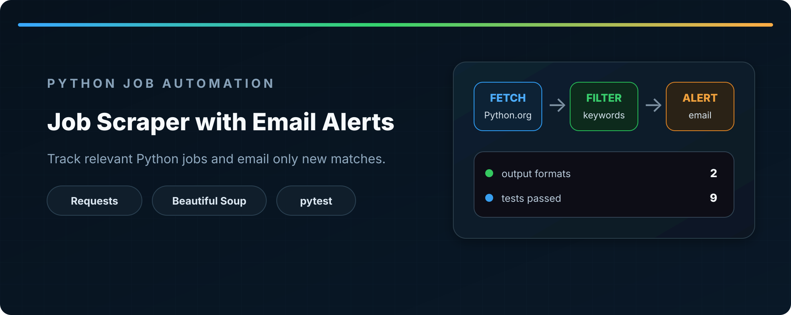
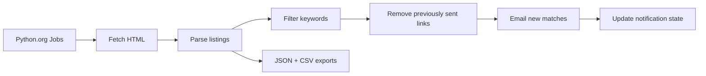

<div align="center">



# Job Scraper with Email Alerts

**Monitor Python job listings, filter relevant roles, track previously sent links, and email only new matches.**

[](https://www.python.org/)
[](#testing)
[](#usage)

</div>

## Overview

This project automates a small job-monitoring workflow around the Python.org job board. It downloads the listings page, parses valid job records, filters titles by configured keywords, excludes links that have already triggered an alert, and sends the remaining matches by email.

Every run also exports the complete parsed dataset to JSON and CSV. State is stored separately so the same job is not emailed repeatedly.

## Workflow



## Features

| Area | Behavior |
|---|---|
| Collection | Fetches the Python.org jobs page with timeout and HTTP status validation |
| Parsing | Extracts valid titles and converts relative links to absolute URLs |
| Filtering | Matches job titles against normalized keywords |
| Deduplication | Removes duplicate links during parsing |
| State | Tracks previously emailed links in a local JSON file |
| Notifications | Sends a configurable number of new matches through Gmail SMTP |
| Exports | Writes the full parsed dataset to JSON and CSV |
| Output safety | Uses temporary files and atomic replacement for JSON, CSV, and state updates |
| Verification | Nine pytest checks cover parsing, filtering, storage, state, and email behavior |

## Tech Stack

| Tool | Purpose |
|---|---|
| Python | Application and data-processing logic |
| Requests | HTTP retrieval |
| Beautiful Soup | HTML parsing |
| smtplib | Email delivery |
| JSON / CSV | State and dataset outputs |
| pathlib | Safe filesystem operations |
| pytest | Automated verification |

## Project Structure

```text
job-scraper-project/
├── src/
│   ├── __init__.py
│   ├── filtering.py
│   ├── main.py
│   ├── notifier.py
│   ├── parser.py
│   ├── saver.py
│   ├── scraper.py
│   └── state.py
├── tests/
│   ├── test_filtering.py
│   ├── test_notifier.py
│   ├── test_parser.py
│   ├── test_saver.py
│   └── test_state.py
├── config.example.json
├── requirements.txt
└── README.md
```

## Installation

```bash
git clone https://github.com/Mr-sanabi/job-scraper-project.git
cd job-scraper-project

python -m venv .venv
```

Activate the environment on Windows:

```powershell
.venv\Scripts\Activate.ps1
```

Install runtime dependencies:

```bash
python -m pip install -r requirements.txt
```

For test development, install pytest as well:

```bash
python -m pip install pytest
```

## Configuration

Copy `config.example.json` to `config.json` and replace the example values:

```json
{
  "email": {
    "from": "your_email@gmail.com",
    "to": "recipient_email@gmail.com",
    "password": "your_gmail_app_password",
    "limit": 5
  },
  "scraping": {
    "delay": 1
  }
}
```

Use a Gmail app password rather than a regular account password. Keep `config.json` local because it contains credentials.

## Usage

Run the application from the repository root:

```bash
python -m src.main
```

A successful run can create:

| File | Contents |
|---|---|
| `all_jobs.json` | All parsed job records |
| `all_jobs.csv` | The same records in tabular form |
| `notified_links.json` | Links already included in successful email alerts |
| `scraper.log` | Runtime events and errors |

## Example Record

```json
{
  "title": "Python Developer",
  "link": "https://www.python.org/jobs/..."
}
```

## Testing

Run the complete test suite from the repository root:

```bash
python -m pytest -q
```

The tests use temporary directories and mocked SMTP behavior, so they do not send real email.

## Reliability Notes

- HTTP requests use a timeout and `raise_for_status()`.
- Invalid or missing configuration stops the run cleanly.
- Duplicate and malformed job links are skipped.
- Notification state is updated only after a successful email send.
- JSON, CSV, and state files are written through temporary files before replacement.
- Missing, malformed, or unreadable state files fall back to an empty state.

## Current Limitations

- The source URL and keyword list are currently defined in `src/main.py`.
- Email delivery is configured specifically for Gmail SMTP.
- The parser depends on the current HTML structure of the source page.
- The project is designed as a scheduled CLI task rather than a continuously running service.
